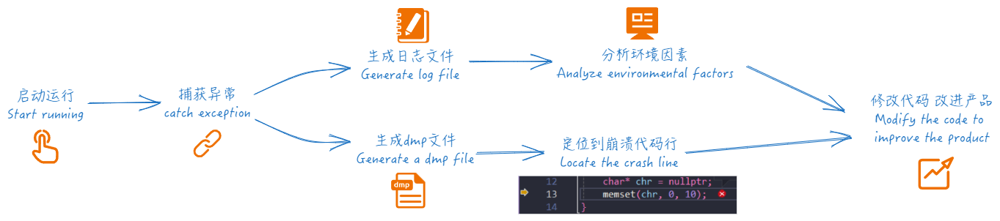
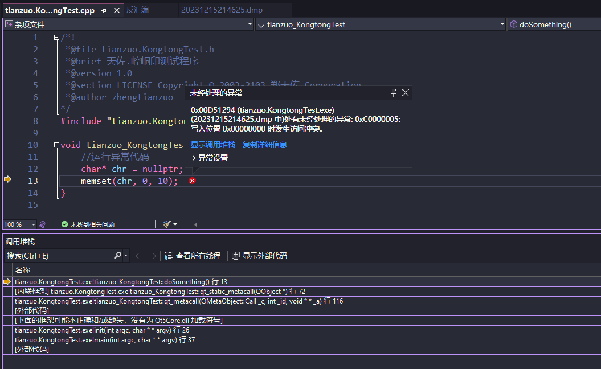
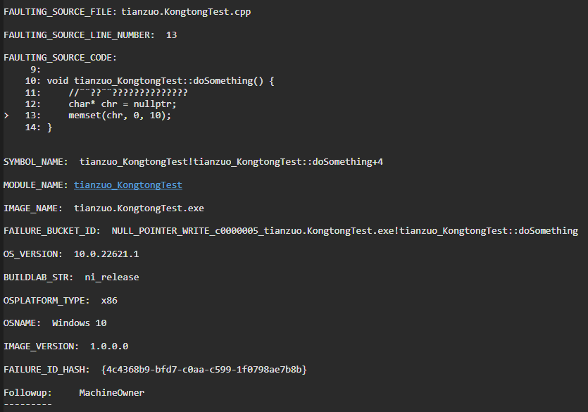
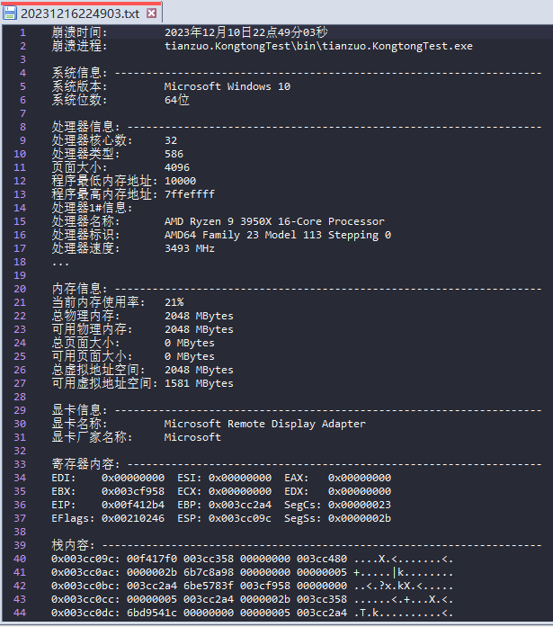
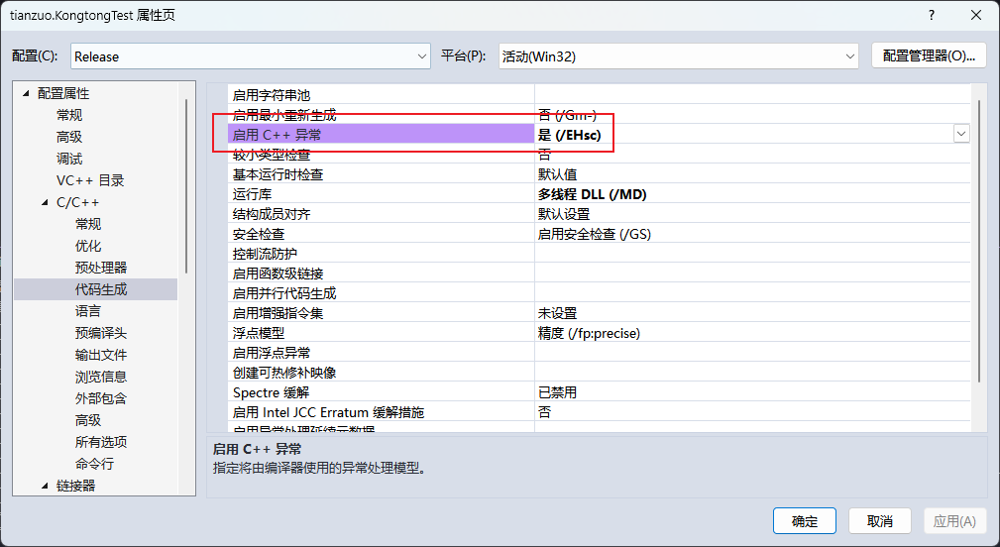
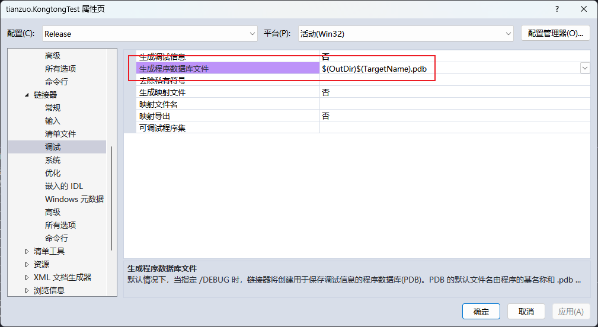
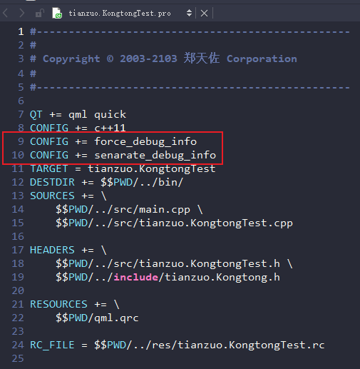

<h4 align="right">简体中文 | <strong><a href="README_en.md">English</a></strong></h4>


### 天佐.崆峒印


||||
|--|--|--|
|操作系统| ||
|编译器|     ||
|编程语言|  ||
# 简介


**天佐.崆峒印** Windows平台下应用程序发生崩溃时, 生成崩溃转储文件用于分析定位到崩溃代码行，同时生成系统环境相关信息。

**传说:**
崆峒海上不死龙族的护守神器，其上刻塑有五方天帝形貌，并有玉龙盘绕。自古相传得到它的人，就能拥有天下，也有人传说它能让人不老不死。

# 目标
开发过程中偶尔遇到程序崩溃的情况，需要分析崩溃原因和定位到代码行，同时需要分析环境因素等。



# 功能

- 🧩 集成简单
- 📝 可选择生成dmp与日志
- 🪐 日志多语言(简体中文/English)
- ⛓ 支持线程内检测

# 截图

**通过dmp文件分析定位崩溃代码行:**

Visual Studio 分析dmp文件



WinDbg 分析dmp文件



**环境日志:**



## 安装

项目中启用异常检测

### Visual Studio


Visual Studio中开启C++异常检测


Visual Studio中开启生成pdb文件

### Qt Creator


Qt Creator中开启生成pdb文件

```cpp
CONFIG += force_debug_info
CONFIG += senarate_debug_info
```

# 例子

```cpp
#include "tianzuo.KongtongTest.h"
#include "../../include/tianzuo.Kongtong.h"
#include <Windows.h>

void init(int argc, char* argv[]) {
    tianzuo_KongtongTest test;
    test.doSomething();
}

int main(int argc, char* argv[]) {
    HINSTANCE hKongtong = LoadLibrary(L"tianzuo.Kongtong.dll");
    if (!hKongtong) {
        init(argc, argv);
        return(0);
    }

    tianzuo_Kongtong_get_exception getException = (tianzuo_Kongtong_get_exception)GetProcAddress(hKongtong, "Kongtong_get_exception");
    if (!getException) return -1;
    __try {
        init(argc, argv);
    }
    __except (getException(GetExceptionInformation(), Kongtong_create_normal, 0)) {
    }

    if (hKongtong != nullptr) {
        getException = nullptr;
        FreeLibrary(hKongtong);
        hKongtong = nullptr;
    }
    return(0);
}
```

# 下载

|||||
|--|--|--|--|
|[](https://github.com/zhengtianzuo/tianzuo.Kongtong/releases)|[](https://gitee.com/zhengtianzuo/tianzuo.Kongtong/releases)|[](https://pan.baidu.com/s/1TnsGHWpFG_NFRrtkZsQcvA?pwd=1234)|[](https://share.weiyun.com/euPExPUJ)|


# 关于
## 联系方式

||||
|--|--|--|
|作者|郑天佐||
|QQ|278969898||
|邮箱|camelsoft@163.com||
|主页|[http://www.camelstudio.cn](http://www.camelstudio.cn)||
|博客|[http://blog.csdn.net/zhengtianzuo06](http://blog.csdn.net/zhengtianzuo06)||
|github|[https://github.com/zhengtianzuo](https://github.com/zhengtianzuo)||
|gitee|[https://gitee.com/zhengtianzuo](https://gitee.com/zhengtianzuo)||
|QQ群|199672080||


|||||
|--|--|--|--|
|加QQ好友|加微信好友|微信打赏|支付宝打赏|


