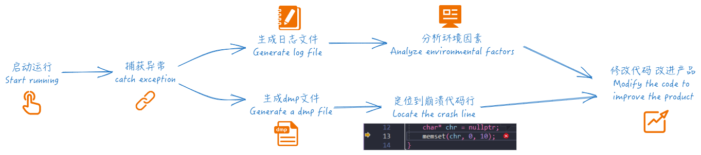

<h4 align="right"><strong><a href="README.md">简体中文</a></strong> | English</h4>


### tianzuo.Kongtong


||||
|--|--|--|
|operating system| ||
|compiler|     ||
|programming language| ||
# introduction


**tianzuo.Kongtong** When an application crashes on a Windows platform, a crash dump file is generated to analyze the lines of the crashed code and generate information about the system environment.

**legend:**
The protective artifact of the undead dragon clan in Kongtong Sea is carved with the shape of the five heavenly emperors and surrounded by a jade dragon. According to ancient legend, those who get it can own the world, and some people say that it can make people not old and immortal.

# motivation
In the process of development, occasionally encounter the situation of program crash, need to analyze the cause of crash and locate the code line, and need to analyze environmental factors.



# features

- 🧩 simple integration
- 📝 optionally generate dmp and logs
- 🪐 log in multiple languages (simplified chinese / english)
- ⛓  support for in-thread detection

# screenshot

**locate crashed lines of code through dmp file analysis:**

Visual Studio analyze the dmp file


WinDbg analyze the dmp file


**environment log:**


## install

enable exception detection in project

### Visual Studio


enable c++ exception detection in Visual Studio


enable generation pdb files in Visual Studio

### Qt Creator


enable generation pdb files in Qt Creator

```cpp
CONFIG += force_debug_info
CONFIG += senarate_debug_info
```

# example

```cpp
#include "tianzuo.KongtongTest.h"
#include "../../include/tianzuo.Kongtong.h"
#include <Windows.h>

void init(int argc, char* argv[]) {
    tianzuo_KongtongTest test;
    test.doSomething();
}

int main(int argc, char* argv[]) {
    HINSTANCE hKongtong = LoadLibrary(L"tianzuo.Kongtong.dll");
    if (!hKongtong) {
        init(argc, argv);
        return(0);
    }

    tianzuo_Kongtong_get_exception getException = (tianzuo_Kongtong_get_exception)GetProcAddress(hKongtong, "Kongtong_get_exception");
    if (!getException) return -1;
    __try {
        init(argc, argv);
    }
    __except (getException(GetExceptionInformation(), Kongtong_create_normal, 0)) {
    }

    if (hKongtong != nullptr) {
        getException = nullptr;
        FreeLibrary(hKongtong);
        hKongtong = nullptr;
    }
    return(0);
}
```

# download

|||||
|--|--|--|--|
|[](https://github.com/zhengtianzuo/tianzuo.Kongtong/releases)|[](https://gitee.com/zhengtianzuo/tianzuo.Kongtong/releases)|[](https://pan.baidu.com/s/1TnsGHWpFG_NFRrtkZsQcvA?pwd=1234)|[](https://share.weiyun.com/euPExPUJ)|

# about
## contact

||||
|--|--|--|
|author|zhengtianzuo||
|QQ|278969898||
|mailbox|camelsoft@163.com||
|homepage|[http://www.camelstudio.cn](http://www.camelstudio.cn)||
|blog|[http://blog.csdn.net/zhengtianzuo06](http://blog.csdn.net/zhengtianzuo06)||
|github|[https://github.com/zhengtianzuo](https://github.com/zhengtianzuo)||
|gitee|[https://gitee.com/zhengtianzuo](https://gitee.com/zhengtianzuo)||
|QQ group|199672080||


|||||
|--|--|--|--|
|Add QQ Friends|Add WeChat Friends|WeChat Sponsor|Alipay Sponsor|


